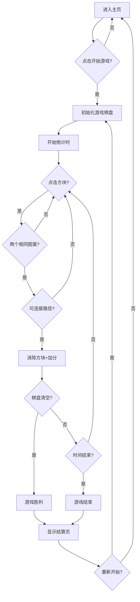

## 1. Product Overview
一款经典的连连看消除小游戏，玩家通过点击匹配相同图案的方块进行消除，在限定时间内清空所有方块即可获胜。游戏操作简单、画面精美，适合各年龄段用户休闲娱乐。

## 2. Core Features

### 2.1 User Roles
| Role | Registration Method | Core Permissions |
|------|---------------------|------------------|
| Player | 无需注册 | 开始游戏、暂停、重新开始、查看分数 |

### 2.2 Feature Module
1. **游戏主页**: 开始游戏按钮、历史最高分显示、游戏规则说明
2. **游戏界面**: 游戏棋盘、计时器、当前分数、暂停/继续按钮
3. **结算界面**: 最终得分、是否通关、重新开始选项

### 2.3 Page Details
| Page Name | Module Name | Feature description |
|-----------|-------------|---------------------|
| 主页 | 开始按钮 | 点击进入游戏 |
| 主页 | 最高分 | 显示历史最高分 |
| 主页 | 规则说明 | 展示游戏玩法说明 |
| 游戏页 | 棋盘 | 8x8的方块网格，包含多种图案 |
| 游戏页 | 计时器 | 倒计时显示，默认60秒 |
| 游戏页 | 分数 | 实时显示当前得分 |
| 游戏页 | 暂停按钮 | 暂停/继续游戏 |
| 结算页 | 结果展示 | 显示最终得分和评价 |
| 结算页 | 重玩按钮 | 重新开始游戏 |

## 3. Core Process
玩家进入主页 → 点击开始游戏 → 进入游戏界面 → 点击两个相同图案方块 → 判断是否可连接 → 可连接则消除并加分 → 继续消除直到清空或时间结束 → 显示结算界面

## 4. User Interface Design
### 4.1 Design Style
- **主色调**: 清新蓝绿色系 (#4ECDC4, #45B7AA)
- **辅助色**: 橙色作为强调色 (#FF6B6B)
- **按钮风格**: 圆角矩形，带渐变效果
- **字体**: 圆润可爱的无衬线字体
- **布局**: 卡片式设计，简洁明快
- **图标风格**: 卡通可爱风格

### 4.2 Page Design Overview
| Page Name | Module Name | UI Elements |
|-----------|-------------|-------------|
| 主页 | 背景 | 渐变背景，轻微动画效果 |
| 主页 | 标题 | 大字号游戏名称，居中显示 |
| 主页 | 按钮 | 开始游戏按钮，悬停放大效果 |
| 游戏页 | 棋盘 | 居中网格布局，方块带阴影 |
| 游戏页 | 状态栏 | 顶部显示时间和分数 |
| 结算页 | 结果卡片 | 弹出式卡片，带庆祝动画 |

### 4.3 Responsiveness
- 移动端优先设计
- 触摸优化，按钮尺寸适合手指点击
- 自适应不同屏幕尺寸

### 4.4 3D Scene Guidance (Not applicable)