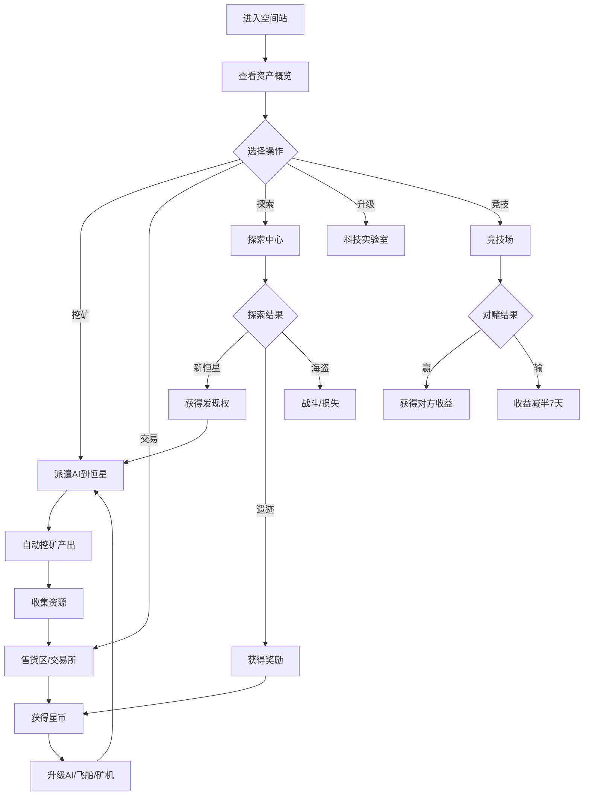

## 1. Product Overview
一款星际挖矿放置类微信小游戏。玩家作为星际矿业主，拥有一颗红矮星、一艘飞船和一个AI。通过派遣AI驻扎恒星挖矿获取资源，在限定时间内完成各种任务目标。游戏融合了资源管理、策略经营和社交竞技元素，核心玩法包括挖矿、交易、升级、探索和竞技场对赌。

## 2. Core Features

### 2.1 User Roles
| Role | Registration Method | Core Permissions |
|------|---------------------|------------------|
| 玩家 | 微信授权登录 | 挖矿、交易、探索、竞技、升级 |

### 2.2 Feature Module
1. **空间站主页**: 显示玩家资产概览、快捷操作入口
2. **售货区**: 买卖矿石，价格实时波动
3. **机库**: 管理AI、飞船、矿机
4. **恒星交易所**: 买卖恒星开采权
5. **探索中心**: 派遣飞船探索宇宙
6. **科技实验室**: 解锁科技树
7. **竞技场**: 对赌采矿收益

### 2.3 Page Details
| Page Name | Module Name | Feature description |
|-----------|-------------|---------------------|
| 空间站主页 | 资产概览 | 显示星币、矿石、恒星数量 |
| 空间站主页 | 快捷操作 | 快速进入各功能模块 |
| 售货区 | 交易面板 | 实时价格、买卖操作 |
| 机库 | AI管理 | AI等级、装备、合成升级 |
| 机库 | 飞船管理 | 飞船等级、槽位 |
| 机库 | 矿机管理 | 矿机数量、加成 |
| 恒星交易所 | 交易市场 | 挂单、购买开采权 |
| 探索中心 | 探索任务 | 派遣飞船探索，1-24小时 |
| 科技实验室 | 科技树 | 解锁新玩法、升级加成 |
| 竞技场 | 对赌界面 | 选择对赌比例、匹配对手 |

## 3. Core Process
玩家进入空间站 → 查看资产 → 派遣AI挖矿 → 收集资源 → 出售矿石 → 升级设备/科技 → 探索新星 → 扩展矿场 → 参与竞技

## 4. User Interface Design
### 4.1 Design Style
- **主色调**: 深空蓝紫色系 (#1a1a2e, #16213e)
- **辅助色**: 星际蓝 (#0f3460)、能量绿 (#4ECDC4)、警告橙 (#FF6B6B)
- **按钮风格**: 圆角矩形，深空主题渐变效果
- **字体**: 现代科幻风格无衬线字体
- **布局**: 模块化卡片设计，深色背景
- **图标风格**: 科幻感图标，发光效果

### 4.2 Page Design Overview
| Page Name | Module Name | UI Elements |
|-----------|-------------|-------------|
| 空间站主页 | 背景 | 星空动画背景 |
| 空间站主页 | 卡片 | 资产卡片，悬浮效果 |
| 售货区 | 价格面板 | 实时价格显示，涨跌动画 |
| 机库 | AI卡片 | 展示AI等级、属性 |
| 探索中心 | 飞船动画 | 飞船发射动画 |
| 竞技场 | 对战界面 | 双方采矿收益对比 |

### 4.3 Responsiveness
- 移动端优先设计
- 触摸优化，按钮尺寸适合手指点击
- 自适应不同屏幕尺寸

### 4.4 3D Scene Guidance (Not applicable)