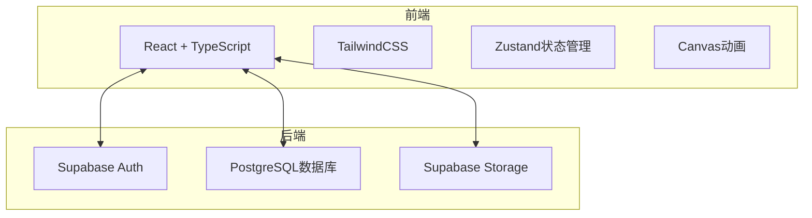
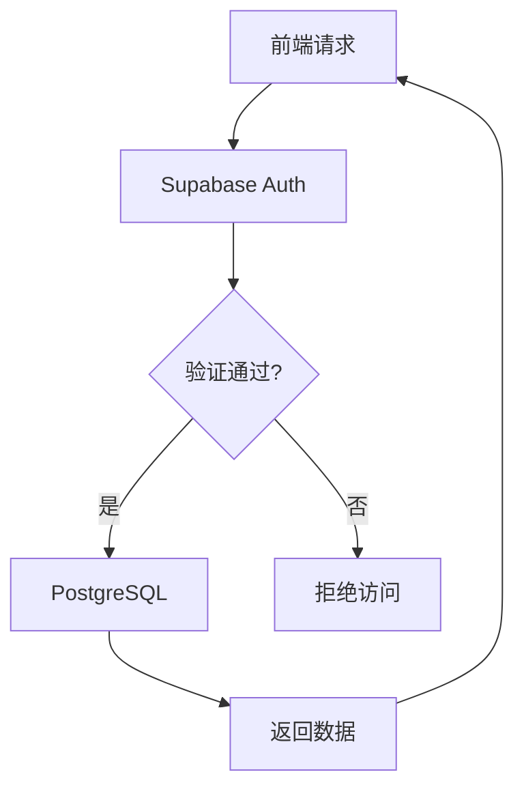
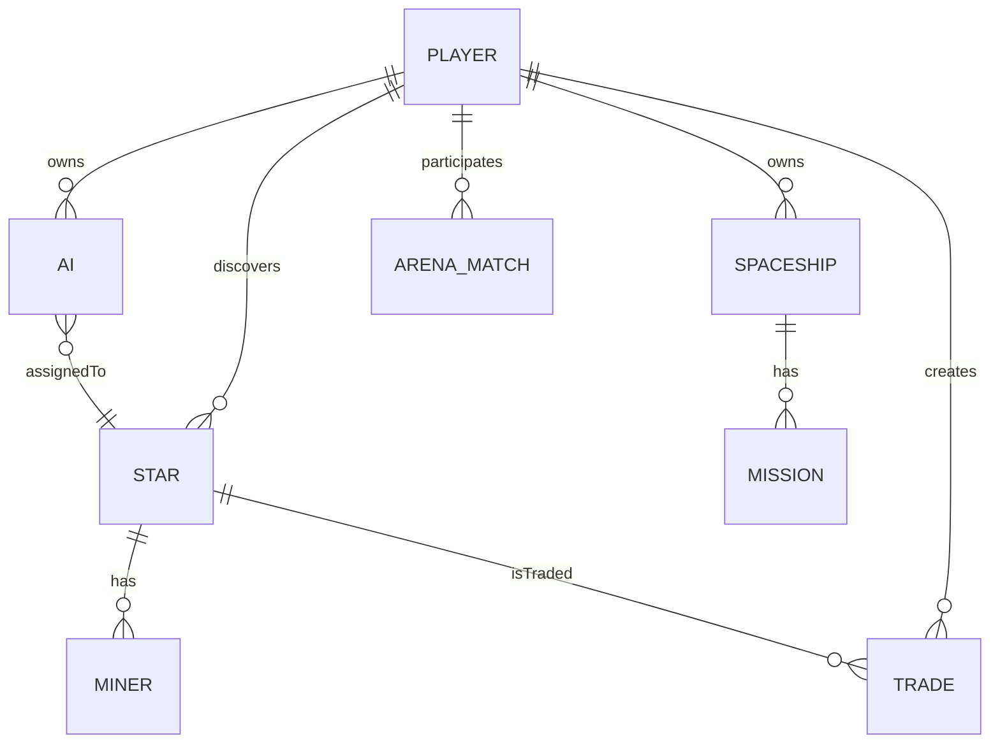

## 1. Architecture Design


## 2. Technology Description
- Frontend: React@18 + TypeScript + Vite
- Styling: TailwindCSS@3
- State Management: Zustand
- Animation: CSS Animations + Canvas
- Backend: Supabase (Auth + Database + Storage)
- Database: PostgreSQL

## 3. Route Definitions
| Route | Purpose |
|-------|---------|
| / | 空间站主页 |
| /market | 售货区 |
| /hangar | 机库 |
| /exchange | 恒星交易所 |
| /explore | 探索中心 |
| /tech | 科技实验室 |
| /arena | 竞技场 |

## 4. API Definitions
### 4.1 玩家数据
```typescript
interface Player {
  id: string;
  username: string;
  starcoins: number;
  createdAt: Date;
  lastOnline: Date;
  mooncardExpires: Date | null;
  techLevel: number;
  techResetCount: number;
}
```

### 4.2 恒星数据
```typescript
interface Star {
  id: string;
  type: 'red' | 'yellow' | 'blue' | 'white' | 'neutron' | 'pulsar' | 'blackhole';
  name: string;
  discovererId: string;
  ownerId: string;
  totalResources: number;
  remainingResources: number;
  status: 'active' | 'depleted' | 'dormant';
  activeUntil: Date;
  dormantUntil: Date;
  maintenanceFee: number;
  createdAt: Date;
}
```

### 4.3 AI数据
```typescript
interface AI {
  id: string;
  playerId: string;
  name: string;
  tier: 1 | 2 | 3 | 4 | 5 | 6;
  profession: 'mining' | 'exploring' | 'combat' | 'allround';
  equipment: AIEquipment[];
  currentStarId: string | null;
  createdAt: Date;
}

interface AIEquipment {
  type: 'drill' | 'scanner' | 'shield' | 'battery' | 'chip' | 'navigator';
  level: number;
}
```

### 4.4 飞船数据
```typescript
interface Spaceship {
  id: string;
  playerId: string;
  name: string;
  level: 1 | 2 | 3 | 4 | 5;
  aiSlots: number;
  currentMission: Mission | null;
  createdAt: Date;
}

interface Mission {
  type: 'exploring' | 'mining';
  targetStarId?: string;
  startTime: Date;
  duration: number;
}
```

### 4.5 矿机数据
```typescript
interface Miner {
  id: string;
  starId: string;
  level: number;
  isDeep: boolean;
  installedAt: Date;
}
```

### 4.6 交易数据
```typescript
interface Trade {
  id: string;
  starId: string;
  sellerId: string;
  buyerId: string | null;
  price: number;
  shares: number;
  status: 'pending' | 'completed' | 'cancelled';
  createdAt: Date;
}
```

### 4.7 竞技场数据
```typescript
interface ArenaMatch {
  id: string;
  player1Id: string;
  player2Id: string;
  stakePercentage: number;
  player1StarId: string;
  player2StarId: string;
  result: 'player1' | 'player2' | null;
  createdAt: Date;
  resolvedAt: Date | null;
}
```

## 5. Server Architecture Diagram


## 6. Data Model
### 6.1 Data Model Definition


### 6.2 Data Definition Language
```sql
CREATE TABLE players (
  id UUID PRIMARY KEY,
  username TEXT NOT NULL,
  starcoins BIGINT DEFAULT 0,
  tech_level INT DEFAULT 1,
  tech_reset_count INT DEFAULT 0,
  mooncard_expires TIMESTAMP,
  created_at TIMESTAMP DEFAULT NOW(),
  last_online TIMESTAMP DEFAULT NOW()
);

CREATE TABLE stars (
  id UUID PRIMARY KEY,
  type TEXT NOT NULL CHECK (type IN ('red', 'yellow', 'blue', 'white', 'neutron', 'pulsar', 'blackhole')),
  name TEXT NOT NULL,
  discoverer_id UUID REFERENCES players(id),
  owner_id UUID REFERENCES players(id),
  total_resources BIGINT NOT NULL,
  remaining_resources BIGINT NOT NULL,
  status TEXT NOT NULL CHECK (status IN ('active', 'depleted', 'dormant')),
  active_until TIMESTAMP,
  dormant_until TIMESTAMP,
  maintenance_fee INT NOT NULL,
  created_at TIMESTAMP DEFAULT NOW()
);

CREATE TABLE ais (
  id UUID PRIMARY KEY,
  player_id UUID REFERENCES players(id),
  name TEXT NOT NULL,
  tier INT NOT NULL CHECK (tier BETWEEN 1 AND 6),
  profession TEXT NOT NULL CHECK (profession IN ('mining', 'exploring', 'combat', 'allround')),
  equipment JSONB DEFAULT '[]',
  current_star_id UUID REFERENCES stars(id),
  created_at TIMESTAMP DEFAULT NOW()
);

CREATE TABLE spaceships (
  id UUID PRIMARY KEY,
  player_id UUID REFERENCES players(id),
  name TEXT NOT NULL,
  level INT NOT NULL CHECK (level BETWEEN 1 AND 5),
  ai_slots INT NOT NULL,
  current_mission JSONB,
  created_at TIMESTAMP DEFAULT NOW()
);

CREATE TABLE miners (
  id UUID PRIMARY KEY,
  star_id UUID REFERENCES stars(id),
  level INT NOT NULL DEFAULT 1,
  is_deep BOOLEAN DEFAULT FALSE,
  installed_at TIMESTAMP DEFAULT NOW()
);

CREATE TABLE trades (
  id UUID PRIMARY KEY,
  star_id UUID REFERENCES stars(id),
  seller_id UUID REFERENCES players(id),
  buyer_id UUID REFERENCES players(id),
  price BIGINT NOT NULL,
  shares INT NOT NULL,
  status TEXT NOT NULL CHECK (status IN ('pending', 'completed', 'cancelled')),
  created_at TIMESTAMP DEFAULT NOW()
);

CREATE TABLE arena_matches (
  id UUID PRIMARY KEY,
  player1_id UUID REFERENCES players(id),
  player2_id UUID REFERENCES players(id),
  stake_percentage INT NOT NULL CHECK (stake_percentage IN (10, 30, 50)),
  player1_star_id UUID REFERENCES stars(id),
  player2_star_id UUID REFERENCES stars(id),
  result TEXT CHECK (result IN ('player1', 'player2')),
  created_at TIMESTAMP DEFAULT NOW(),
  resolved_at TIMESTAMP
);
```