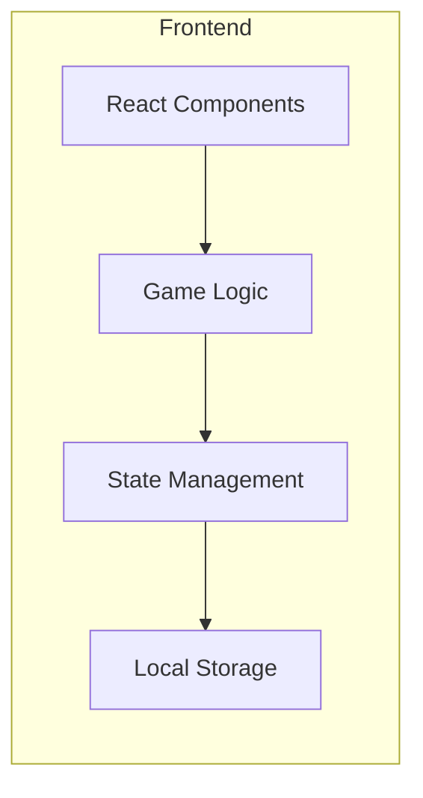

## 1. Architecture Design
```m## 1. Architecture Design
```mermaid
flowchart LR
    subgraph Frontend
        A[React Components] --> B## 1. Architecture Design
```mermaid
flowchart LR
    subgraph Frontend
        A[React Components] --> B[Game Logic]
        B --> C[State Management]
        C --> D[Local## 1. Architecture Design
```mermaid
flowchart LR
    subgraph Frontend
        A[React Components] --> B[Game Logic]
        B --> C[State Management]
        C --> D[Local Storage]
    end
```

## 2. Technology Description
- **Frontend**:## 1. Architecture Design


## 2. Technology Description
- **Frontend**: React@18 + TypeScript + TailwindCSS@3 + Vite
- **Initial## 1. Architecture Design


## 2. Technology Description
- **Frontend**: React@18 + TypeScript + TailwindCSS@3 + Vite
- **Initialization Tool**: vite-init
- **Backend**: None (纯前端游戏)
- **Database## 1. Architecture Design


## 2. Technology Description
- **Frontend**: React@18 + TypeScript + TailwindCSS@3 + Vite
- **Initialization Tool**: vite-init
- **Backend**: None (纯前端游戏)
- **Database**: LocalStorage (存储最高分)

## 3. Route Definitions
| Route | Purpose |## 1. Architecture Design


## 2. Technology Description
- **Frontend**: React@18 + TypeScript + TailwindCSS@3 + Vite
- **Initialization Tool**: vite-init
- **Backend**: None (纯前端游戏)
- **Database**: LocalStorage (存储最高分)

## 3. Route Definitions
| Route | Purpose |
|-------|---------|
| / | 游戏主页 |

## 4. API## 1. Architecture Design


## 2. Technology Description
- **Frontend**: React@18 + TypeScript + TailwindCSS@3 + Vite
- **Initialization Tool**: vite-init
- **Backend**: None (纯前端游戏)
- **Database**: LocalStorage (存储最高分)

## 3. Route Definitions
| Route | Purpose |
|-------|---------|
| / | 游戏主页 |

## 4. API Definitions (Not applicable)

## 5. Server Architecture Diagram (Not applicable)

#### 1. Architecture Design


## 2. Technology Description
- **Frontend**: React@18 + TypeScript + TailwindCSS@3 + Vite
- **Initialization Tool**: vite-init
- **Backend**: None (纯前端游戏)
- **Database**: LocalStorage (存储最高分)

## 3. Route Definitions
| Route | Purpose |
|-------|---------|
| / | 游戏主页 |

## 4. API Definitions (Not applicable)

## 5. Server Architecture Diagram (Not applicable)

## 6. Data Model
### 6.1 Data Model Definition
- **GameState**:## 1. Architecture Design


## 2. Technology Description
- **Frontend**: React@18 + TypeScript + TailwindCSS@3 + Vite
- **Initialization Tool**: vite-init
- **Backend**: None (纯前端游戏)
- **Database**: LocalStorage (存储最高分)

## 3. Route Definitions
| Route | Purpose |
|-------|---------|
| / | 游戏主页 |

## 4. API Definitions (Not applicable)

## 5. Server Architecture Diagram (Not applicable)

## 6. Data Model
### 6.1 Data Model Definition
- **GameState**: 游戏状态（进行中/暂停/结束）
- **Board**: 8x8二维## 1. Architecture Design


## 2. Technology Description
- **Frontend**: React@18 + TypeScript + TailwindCSS@3 + Vite
- **Initialization Tool**: vite-init
- **Backend**: None (纯前端游戏)
- **Database**: LocalStorage (存储最高分)

## 3. Route Definitions
| Route | Purpose |
|-------|---------|
| / | 游戏主页 |

## 4. API Definitions (Not applicable)

## 5. Server Architecture Diagram (Not applicable)

## 6. Data Model
### 6.1 Data Model Definition
- **GameState**: 游戏状态（进行中/暂停/结束）
- **Board**: 8x8二维数组，存储方块信息
- **Tile**: 方块对象（id, type, row,## 1. Architecture Design


## 2. Technology Description
- **Frontend**: React@18 + TypeScript + TailwindCSS@3 + Vite
- **Initialization Tool**: vite-init
- **Backend**: None (纯前端游戏)
- **Database**: LocalStorage (存储最高分)

## 3. Route Definitions
| Route | Purpose |
|-------|---------|
| / | 游戏主页 |

## 4. API Definitions (Not applicable)

## 5. Server Architecture Diagram (Not applicable)

## 6. Data Model
### 6.1 Data Model Definition
- **GameState**: 游戏状态（进行中/暂停/结束）
- **Board**: 8x8二维数组，存储方块信息
- **Tile**: 方块对象（id, type, row, col, isMatched）
- **Score**: 当前分数和最高分

### 6.## 1. Architecture Design


## 2. Technology Description
- **Frontend**: React@18 + TypeScript + TailwindCSS@3 + Vite
- **Initialization Tool**: vite-init
- **Backend**: None (纯前端游戏)
- **Database**: LocalStorage (存储最高分)

## 3. Route Definitions
| Route | Purpose |
|-------|---------|
| / | 游戏主页 |

## 4. API Definitions (Not applicable)

## 5. Server Architecture Diagram (Not applicable)

## 6. Data Model
### 6.1 Data Model Definition
- **GameState**: 游戏状态（进行中/暂停/结束）
- **Board**: 8x8二维数组，存储方块信息
- **Tile**: 方块对象（id, type, row, col, isMatched）
- **Score**: 当前分数和最高分

### 6.2 Data Structure
```typescript
interface Tile {
  id: string;
  type## 1. Architecture Design


## 2. Technology Description
- **Frontend**: React@18 + TypeScript + TailwindCSS@3 + Vite
- **Initialization Tool**: vite-init
- **Backend**: None (纯前端游戏)
- **Database**: LocalStorage (存储最高分)

## 3. Route Definitions
| Route | Purpose |
|-------|---------|
| / | 游戏主页 |

## 4. API Definitions (Not applicable)

## 5. Server Architecture Diagram (Not applicable)

## 6. Data Model
### 6.1 Data Model Definition
- **GameState**: 游戏状态（进行中/暂停/结束）
- **Board**: 8x8二维数组，存储方块信息
- **Tile**: 方块对象（id, type, row, col, isMatched）
- **Score**: 当前分数和最高分

### 6.2 Data Structure
```typescript
interface Tile {
  id: string;
  type: number;
  row: number;
  col: number;
  isMatched## 1. Architecture Design


## 2. Technology Description
- **Frontend**: React@18 + TypeScript + TailwindCSS@3 + Vite
- **Initialization Tool**: vite-init
- **Backend**: None (纯前端游戏)
- **Database**: LocalStorage (存储最高分)

## 3. Route Definitions
| Route | Purpose |
|-------|---------|
| / | 游戏主页 |

## 4. API Definitions (Not applicable)

## 5. Server Architecture Diagram (Not applicable)

## 6. Data Model
### 6.1 Data Model Definition
- **GameState**: 游戏状态（进行中/暂停/结束）
- **Board**: 8x8二维数组，存储方块信息
- **Tile**: 方块对象（id, type, row, col, isMatched）
- **Score**: 当前分数和最高分

### 6.2 Data Structure
```typescript
interface Tile {
  id: string;
  type: number;
  row: number;
  col: number;
  isMatched: boolean;
}

interface GameState {
  board: Tile[][];
## 1. Architecture Design


## 2. Technology Description
- **Frontend**: React@18 + TypeScript + TailwindCSS@3 + Vite
- **Initialization Tool**: vite-init
- **Backend**: None (纯前端游戏)
- **Database**: LocalStorage (存储最高分)

## 3. Route Definitions
| Route | Purpose |
|-------|---------|
| / | 游戏主页 |

## 4. API Definitions (Not applicable)

## 5. Server Architecture Diagram (Not applicable)

## 6. Data Model
### 6.1 Data Model Definition
- **GameState**: 游戏状态（进行中/暂停/结束）
- **Board**: 8x8二维数组，存储方块信息
- **Tile**: 方块对象（id, type, row, col, isMatched）
- **Score**: 当前分数和最高分

### 6.2 Data Structure
```typescript
interface Tile {
  id: string;
  type: number;
  row: number;
  col: number;
  isMatched: boolean;
}

interface GameState {
  board: Tile[][];
  score: number;
  highScore: number;
  timeLeft: number;
## 1. Architecture Design


## 2. Technology Description
- **Frontend**: React@18 + TypeScript + TailwindCSS@3 + Vite
- **Initialization Tool**: vite-init
- **Backend**: None (纯前端游戏)
- **Database**: LocalStorage (存储最高分)

## 3. Route Definitions
| Route | Purpose |
|-------|---------|
| / | 游戏主页 |

## 4. API Definitions (Not applicable)

## 5. Server Architecture Diagram (Not applicable)

## 6. Data Model
### 6.1 Data Model Definition
- **GameState**: 游戏状态（进行中/暂停/结束）
- **Board**: 8x8二维数组，存储方块信息
- **Tile**: 方块对象（id, type, row, col, isMatched）
- **Score**: 当前分数和最高分

### 6.2 Data Structure
```typescript
interface Tile {
  id: string;
  type: number;
  row: number;
  col: number;
  isMatched: boolean;
}

interface GameState {
  board: Tile[][];
  score: number;
  highScore: number;
  timeLeft: number;
  isPlaying: boolean;
  isPaused: boolean;
  isGameOver: boolean## 1. Architecture Design


## 2. Technology Description
- **Frontend**: React@18 + TypeScript + TailwindCSS@3 + Vite
- **Initialization Tool**: vite-init
- **Backend**: None (纯前端游戏)
- **Database**: LocalStorage (存储最高分)

## 3. Route Definitions
| Route | Purpose |
|-------|---------|
| / | 游戏主页 |

## 4. API Definitions (Not applicable)

## 5. Server Architecture Diagram (Not applicable)

## 6. Data Model
### 6.1 Data Model Definition
- **GameState**: 游戏状态（进行中/暂停/结束）
- **Board**: 8x8二维数组，存储方块信息
- **Tile**: 方块对象（id, type, row, col, isMatched）
- **Score**: 当前分数和最高分

### 6.2 Data Structure
```typescript
interface Tile {
  id: string;
  type: number;
  row: number;
  col: number;
  isMatched: boolean;
}

interface GameState {
  board: Tile[][];
  score: number;
  highScore: number;
  timeLeft: number;
  isPlaying: boolean;
  isPaused: boolean;
  isGameOver: boolean;
  isWin: boolean;
}
```

## 7. Game Logic
## 1. Architecture Design


## 2. Technology Description
- **Frontend**: React@18 + TypeScript + TailwindCSS@3 + Vite
- **Initialization Tool**: vite-init
- **Backend**: None (纯前端游戏)
- **Database**: LocalStorage (存储最高分)

## 3. Route Definitions
| Route | Purpose |
|-------|---------|
| / | 游戏主页 |

## 4. API Definitions (Not applicable)

## 5. Server Architecture Diagram (Not applicable)

## 6. Data Model
### 6.1 Data Model Definition
- **GameState**: 游戏状态（进行中/暂停/结束）
- **Board**: 8x8二维数组，存储方块信息
- **Tile**: 方块对象（id, type, row, col, isMatched）
- **Score**: 当前分数和最高分

### 6.2 Data Structure
```typescript
interface Tile {
  id: string;
  type: number;
  row: number;
  col: number;
  isMatched: boolean;
}

interface GameState {
  board: Tile[][];
  score: number;
  highScore: number;
  timeLeft: number;
  isPlaying: boolean;
  isPaused: boolean;
  isGameOver: boolean;
  isWin: boolean;
}
```

## 7. Game Logic
### 7.1 连连看连接算法
- 两个方块可以通过最多两个拐点## 1. Architecture Design


## 2. Technology Description
- **Frontend**: React@18 + TypeScript + TailwindCSS@3 + Vite
- **Initialization Tool**: vite-init
- **Backend**: None (纯前端游戏)
- **Database**: LocalStorage (存储最高分)

## 3. Route Definitions
| Route | Purpose |
|-------|---------|
| / | 游戏主页 |

## 4. API Definitions (Not applicable)

## 5. Server Architecture Diagram (Not applicable)

## 6. Data Model
### 6.1 Data Model Definition
- **GameState**: 游戏状态（进行中/暂停/结束）
- **Board**: 8x8二维数组，存储方块信息
- **Tile**: 方块对象（id, type, row, col, isMatched）
- **Score**: 当前分数和最高分

### 6.2 Data Structure
```typescript
interface Tile {
  id: string;
  type: number;
  row: number;
  col: number;
  isMatched: boolean;
}

interface GameState {
  board: Tile[][];
  score: number;
  highScore: number;
  timeLeft: number;
  isPlaying: boolean;
  isPaused: boolean;
  isGameOver: boolean;
  isWin: boolean;
}
```

## 7. Game Logic
### 7.1 连连看连接算法
- 两个方块可以通过最多两个拐点的路径连接
- 路径上不能有其他方块阻挡
- 使用BFS或DFS